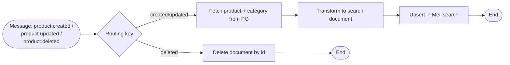
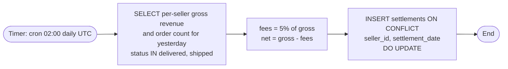
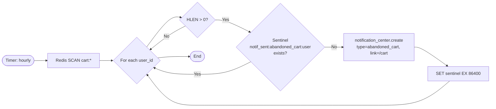
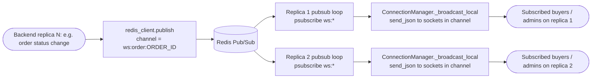

# BPMN — Event Pipelines (R10)

Textual descriptions of the runtime pipelines as Mermaid flowcharts. For the report they are imported into bpmn.io / draw.io and exported as PNG/SVG.

---

## BPMN 1 — Order Fulfilment Pipeline

```mermaid
flowchart LR
    Checkout([Start: POST /api/orders]) --> Decrement[Decrement variant or inventory stock<br/>SELECT FOR UPDATE]
    Decrement --> Coupon{coupon_code?}
    Coupon -- Yes --> Apply[Validate + apply coupon<br/>discount on total]
    Coupon -- No --> Persist
    Apply --> Persist[Persist order + items + pending event]
    Persist --> LowStock{remaining < 10?}
    LowStock -- Yes --> NotifySeller[Notify seller user]
    LowStock -- No --> Created
    NotifySeller --> Created([Publish order.created])
    Created --> Confirm[Advance: confirmed<br/>delay 2.0s]
    Confirm --> Process[Advance: processing<br/>delay 0.5s]
    Process --> Pack[Advance: packed<br/>delay 3.0s]
    Pack --> Ship[Advance: shipped<br/>delay 1.0s]
    Ship --> Delivered[Manual: admin PATCH /status<br/>optional tracking_number]
    Delivered --> EndOk([End: delivered])
```



Stock is decremented synchronously at checkout (`order_service.checkout`). When a `variant_id` is on the cart row the lock and decrement target `product_variants`; otherwise legacy `inventory`. Insufficient stock raises HTTP 409 before any event is published, so the pipeline has no cancel branch. Each transition writes a row to `order_events`, broadcasts the new status over WebSocket (via the Redis pub/sub-backed manager), and republishes the next routing key on the `ecommerce` exchange. Auto-advance pipeline implemented in `app/workers/order_pipeline.py` (`NEXT_STAGE` map) terminates at `shipped`; `delivered` is reached only via admin `PATCH /api/orders/{id}/status` (which also accepts an optional `tracking_number`). Reaching `delivered` or `shipped` unlocks Return creation.

---

## BPMN 2 — Daily Sales Batch


Aggregation (`order_count`, `total_revenue`, `unique_customers`, filtered to `status <> 'cancelled'`) lives in the materialized view itself, defined in `alembic/versions/006_mv_daily_sales.py`. Implementation: `app/batch/daily_sales.py`.

---

## BPMN 3 — Search Index Sync



Implementation: `app/workers/search_sync.py`. Queue `search_sync` is bound to exchange `ecommerce` by routing key `product.*`.

---

## BPMN 4 — Daily Settlement Batch



Implementation: `app/batch/daily_settlement.py`. Sellers view payouts via `GET /api/settlements/me`.

---

## BPMN 5 — Abandoned Cart Batch



Implementation: `app/batch/abandoned_cart.py`. The sentinel TTL ensures at most one nudge per user per 24 h.

---

## BPMN 6 — WebSocket Cross-Replica Fanout



Implementation: `app/routers/ws.py`. `ConnectionManager.broadcast(channel, payload)` publishes to `ws:{channel}`; on startup each replica runs `start_pubsub(redis_client)` which `PSUBSCRIBE`s `ws:*` and delivers every message to local sockets via `_broadcast_local`. If Redis is unavailable, `broadcast` falls back to a local-only send. Channels in use: `order:{id}`, `inventory`, `user:{id}`, `chat:{conversation_id}`.

---

## BPMN 7 — Product Image Upload

```mermaid
flowchart LR
    Pick([Seller drops/picks file<br/>SellerProducts.tsx]) --> Form[FormData<br/>file + alt + position]
    Form --> Post[POST /api/products/&#123;product_id&#125;/images<br/>multipart/form-data]
    Post --> Auth{Auth dep<br/>admin or owning seller?}
    Auth -- No --> Deny([403 Forbidden])
    Auth -- Yes --> Mime{Content-Type in<br/>image/jpeg|png|webp|gif?}
    Mime -- No --> Bad([415 Unsupported])
    Mime -- Yes --> Size{Body <= 5 MB?}
    Size -- No --> Big([413 Too large])
    Size -- Yes --> Key[Generate key<br/>&#123;product_id&#125;/&#123;uuid4&#125;.&#123;ext&#125;]
    Key --> Put[storage_service.upload<br/>MinIO SDK via asyncio.to_thread]
    Put --> Bucket[(MinIO bucket<br/>product-images<br/>anonymous-read policy)]
    Put --> Row[INSERT product_images<br/>url = MINIO_PUBLIC_URL + key]
    Row --> Resp([201 ProductImageOut])
    Resp --> List[Frontend reloads gallery<br/>imagesApi.list]
    List --> Carousel[Storefront Carousel<br/>component renders<br/>primary + gallery]
```

Implementation:
- Endpoint: `backend/app/routers/product_images.py` (`POST` multipart, `GET` list, `DELETE` removes SQL row + best-effort MinIO object).
- Storage: `backend/app/services/storage_service.py` — sync `minio` SDK wrapped with `asyncio.to_thread`; methods `upload`, `delete`, `public_url`, `key_from_url`.
- Bucket bootstrap: `minio-init` one-shot container (in `docker-compose.yml`) runs `mc anonymous set download local/product-images` so the bucket is publicly readable. The backend `depends_on` it.
- Frontend: `frontend/src/components/Carousel.tsx` (display) and the dropzone + upload-progress UI in `frontend/src/pages/seller/SellerProducts.tsx`. `imagesApi.upload(product_id, file, { alt, position, onProgress })` in `frontend/src/api.ts` posts the `FormData` with an `onUploadProgress` hook so the bar reflects real network progress.
- Seeder: `backend/seeds/seed.py` populates `Product.image_url` from `PRODUCT_IMAGE_LIBRARY` (curated Unsplash CDN URLs, 1 primary + 3 gallery per product); no MinIO write at seed time so the database has displayable images even before any upload.
