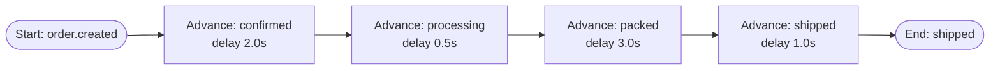
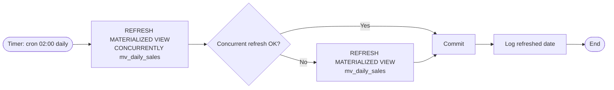

# BPMN -- Event Pipeline (R10)

Below are textual descriptions of the three required diagrams (Mermaid flowchart). For the report they are imported into bpmn.io / draw.io and exported as PNG/SVG.

---

## BPMN 1 -- Order Fulfilment Pipeline

Stock is decremented synchronously at checkout (`order_service.checkout`); insufficient stock raises HTTP 409 before any event is published, so the pipeline has no cancel branch. Each transition writes a row to `order_events`, broadcasts the new status over WebSocket, and republishes the next routing key on the `ecommerce` exchange. Consumer: `app/workers/order_pipeline.py` (`NEXT_STAGE` map). `shipped` is terminal — there is no `delivered` stage in the running code.

---

## BPMN 2 -- Daily Sales Batch

Aggregation (`order_count`, `total_revenue`, `unique_customers`, filtered to `status <> 'cancelled'`) lives in the materialized view itself, defined in `alembic/versions/006_mv_daily_sales.py`. The scheduled job only refreshes the view; it does not query or aggregate orders directly. Implementation: `app/batch/daily_sales.py` (APScheduler cron `hour=2, minute=0`).

---

## BPMN 3 -- Search Index Sync

Implementation: `app/workers/search_sync.py`. Queue `search_sync` is bound to exchange `ecommerce` by routing key `product.*`.
