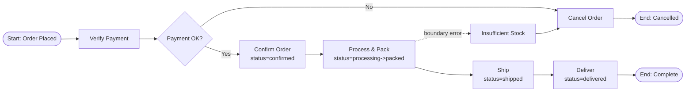
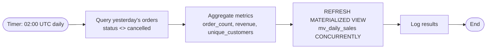

# BPMN -- Event Pipeline (R10)

Below are textual descriptions of the three required diagrams (Mermaid flowchart). For the report they are imported into bpmn.io / draw.io and exported as PNG/SVG.

---

## BPMN 1 -- Order Fulfilment Pipeline

Each transition inserts a row into `order_events` (audit trail) and publishes an event to the RabbitMQ topic `order.*`. The consumer is `app/workers/order_pipeline.py`.

---

## BPMN 2 -- Daily Sales Batch

Implementation: `app/batch/daily_sales.py` (APScheduler cron `hour=2`).

---

## BPMN 3 -- Search Index Sync

Implementation: `app/workers/search_sync.py`. Queue `search_sync` is bound to exchange `ecommerce` by routing key `product.*`.
